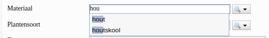
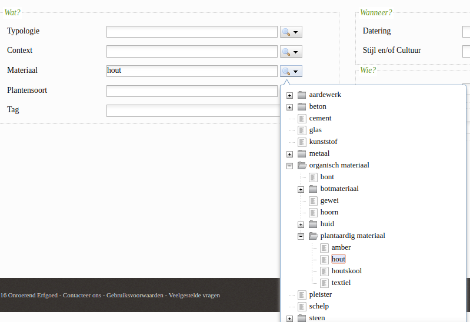

# thesaurus-widget
A widget that can interact with a thesaurus api to select concepts.

This widget is a pluggable component that acts as a frontend to a thesaurus api provided by [athramisis](https://github.com/OnroerendErfgoed/atramhasis). This API has following endpoints: http://atramhasis.readthedocs.io/en/latest/services.html

## Specs

### Version 0.1
- this should be a custom [Aurelia](http://aurelia.io/) component that can be used in other Aurelia projects
- the component can interact with the api of a thesaurus
- the user can select a concept using a text input field with autocompletion:

- the user can select a concept usign a popup that contains a tree of the thesaurus:

- the component has a bindable property with the selected concept (make this an array for future enhancements)
- the component can be configured with:
  - a uri to a specific thesaurus (e.g. https://dev-thesaurus.onroerenderfgoed.be/conceptschemes/MATERIALEN)
  - the way a user can select a concept ('autocomplete','tree','both')
  - if the component is a multiselect or not ('true','false'). This version only supports false
- add meaningfull, unique class names to the html elements and an example style sheet (.scss)
- there should be isolated test pages where the component can be tested manually
- there should be useful unit & functional tests

